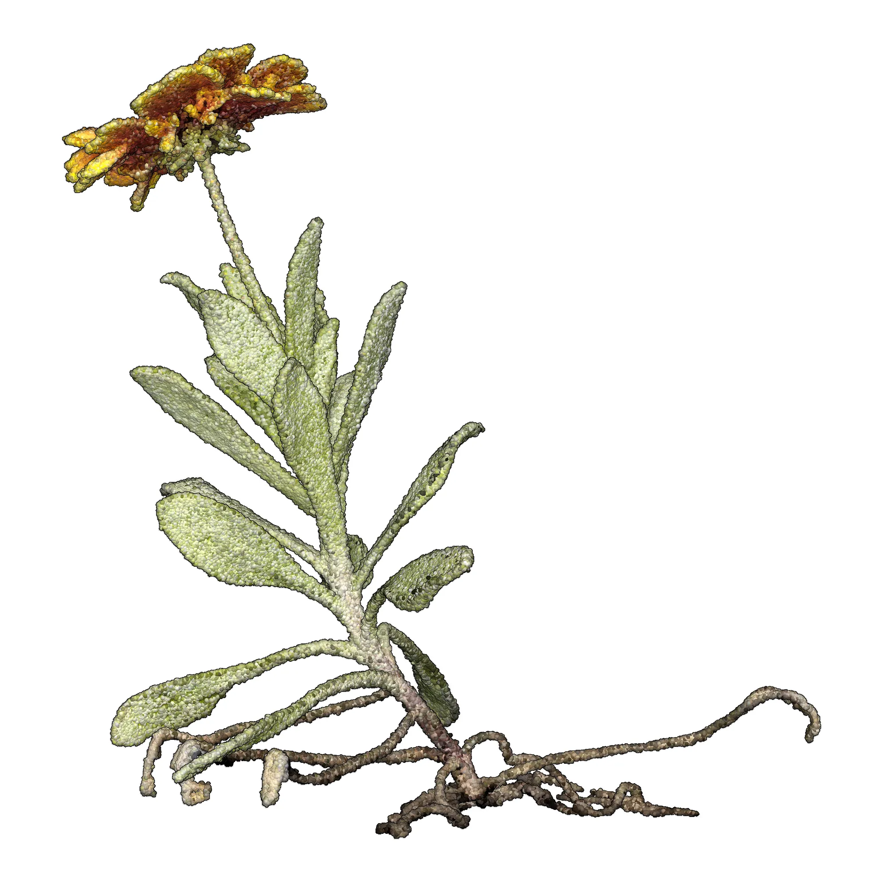
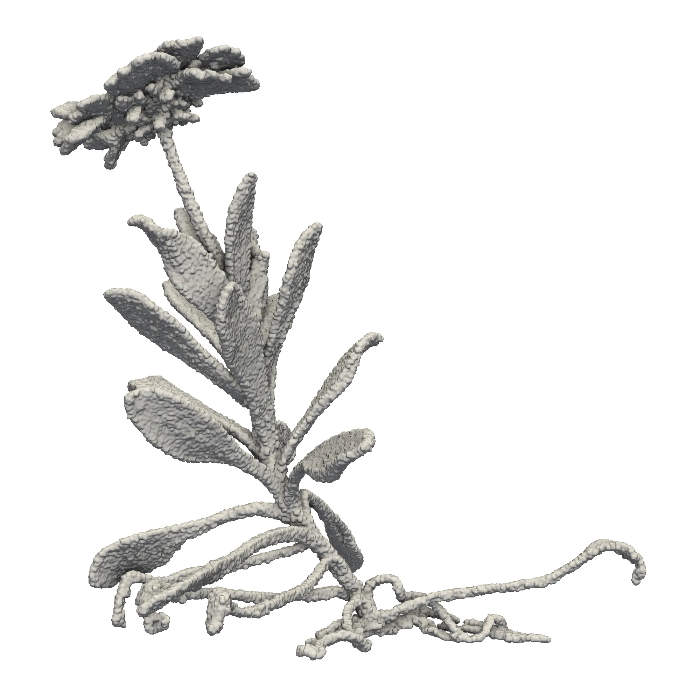

[](https://opensource.org/licenses/MIT)

# 3D Printing Landscape

| Point cloud | Manifold mesh |
| ----------- | ------------- |
|  |  |

A collection of scripts and computational notebooks 
for 3D printing landscape released under the MIT license.
Each script or notebook will download the necessary point clouds
from the Open Science Framework [repository](https://osf.io/vr5xs).
These point clouds and many more are included in the
[Cloud Forest Library](https://doi.org/10.5281/zenodo.8194066) and
[Atlas of Heritage Trees](https://doi.org/10.5281/zenodo.8353292)
datasets under the Creative Commons Zero public domain dedication.

## Setup

Create a Conda environment with the dependencies:

```bash
conda env create --file environment.yml
```

Or create a Pixi environment with the dependencies:

```bash
pixi install
```

## Usage

Activate the Conda environment and then run a notebook:

```bash
conda activate 3dp
jupyter lab notebooks/gaillardia-aristata.ipynb
```

Or activate the Pixi environment and then run a notebook:
```bash
pixi run jupyter lab notebooks/gaillardia-aristata.ipynb
```

## Structure

```
.
└── 3d-printing-landscape/
    ├── tools/
    │   └── *.py
    ├── clouds/
    │   └── *.ply
    ├── scripts/
    │   └── *.py
    ├── notebooks/
    │   └── *.ipynb
    ├── images/
    │   ├── *.png
    │   └── *.webp
    └── prints/
        └── *.3mf
```